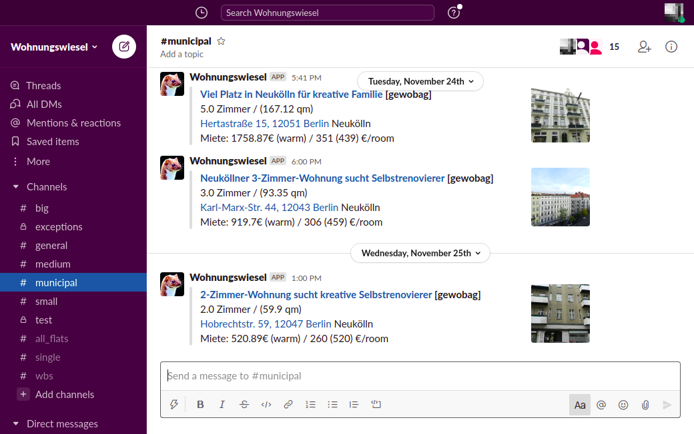

# Wohnungswiesel

Flat hunting in Berlin can be very challenging. Wohnungswiesel is a little collection of [Scrapy](https://scrapy.org/) 
scripts that collect flats from different sources and post them to a Slack channel. 

Note that this project is a private proof-of-concept. In case you want to run it, please double-check terms and 
conditions of the websites you want to scrape.
